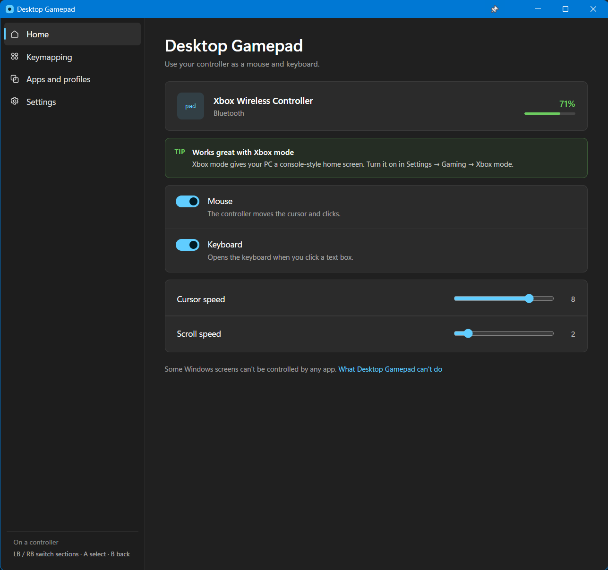
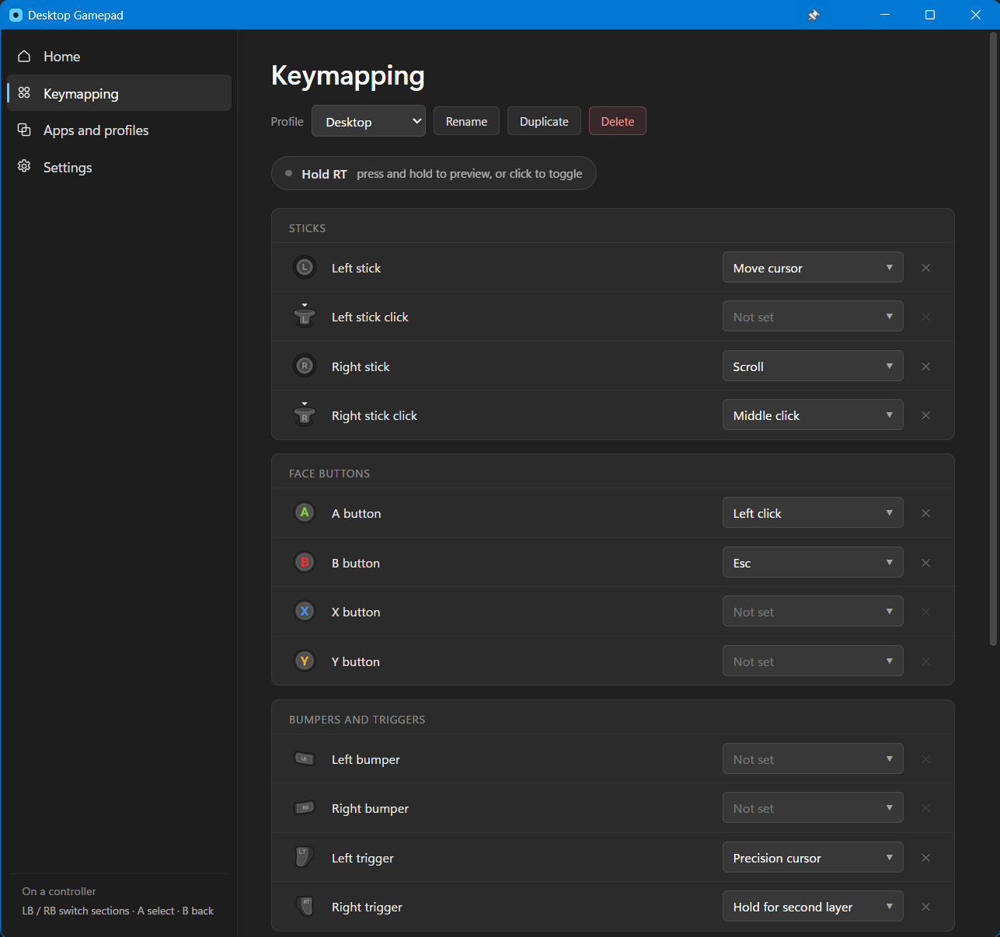

# Desktop Gamepad

**Use your controller as a mouse and keyboard on Windows, so you can run your PC from the couch.**

Works great with the new Windows Xbox mode.



## Features

- **Mouse** — the sticks move the cursor and scroll; buttons click, type keys and run shortcuts.
- **Console-style typing** — click a text box and the on-screen keyboard pops up by itself, exactly like on an Xbox or a PlayStation. You type with the controller and never reach for a keyboard. Together with a cursor you drive with the stick, that gives you the complete console experience on a normal PC.
- **Per-app profiles** — your own button layout for a browser, a video player, or any app you add.
- **Second layer** — hold one button and every other button does a second job.
- **Stays out of the way** — hands the controller straight back to games, and to apps that already read one, such as the Xbox app, the Microsoft Store, Start and Xbox mode. You don't switch anything.
- **Clean screen** — hides the mouse pointer when it isn't needed, and puts it back when you move it.
- **Conflict warning** — tells you when another app is using the same controller, which can cause problems.
- **Small and quiet** — no drivers, no background hooks in games, and it sleeps while no controller is connected.

Built and tested with Xbox controllers, over USB or Bluetooth. PlayStation pads and other controllers should work too.

Every stick, button and trigger is yours to set, per profile:



## Install

1. Download the setup file from [Releases](../../releases).
2. Run it. It installs for you only, so it needs no administrator rights.

Windows may show a blue **Windows protected your PC** box, because this app is not signed with a paid certificate. Click **More info**, then **Run anyway**.

## Requirements

- Windows 10 version 1809 or later, or Windows 11
- .NET Framework 4.8 and the WebView2 runtime — both come with Windows 11, and the installer tells you if one is missing

No account, no ads, and nothing leaves your PC.

## Build from source

You need the .NET SDK and Node.js.

```
cd ui
npm install
npm run build

cd ..\src\DesktopGamepad
dotnet build -c Release
```

The app is then in `src\DesktopGamepad\bin\Release\net48`.

## License

MIT. See [LICENSE](LICENSE).

## Credits

Controller button art based on [Xelu's Free Controller & Key Prompts](https://thoseawesomeguys.com/prompts/).
